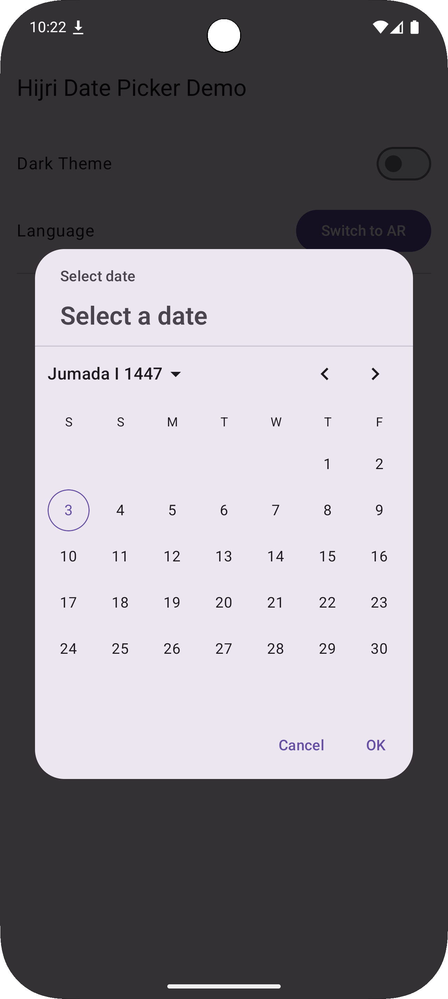
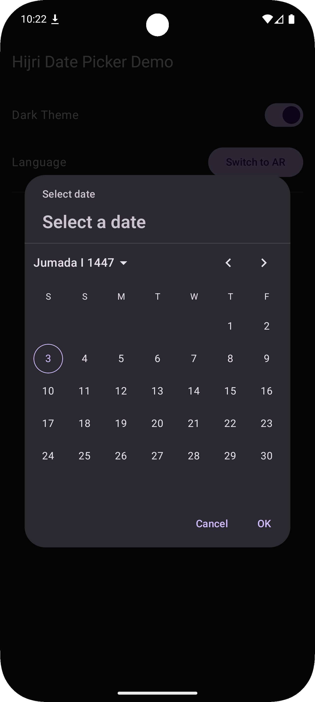
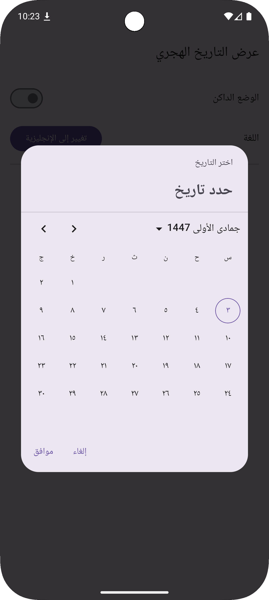
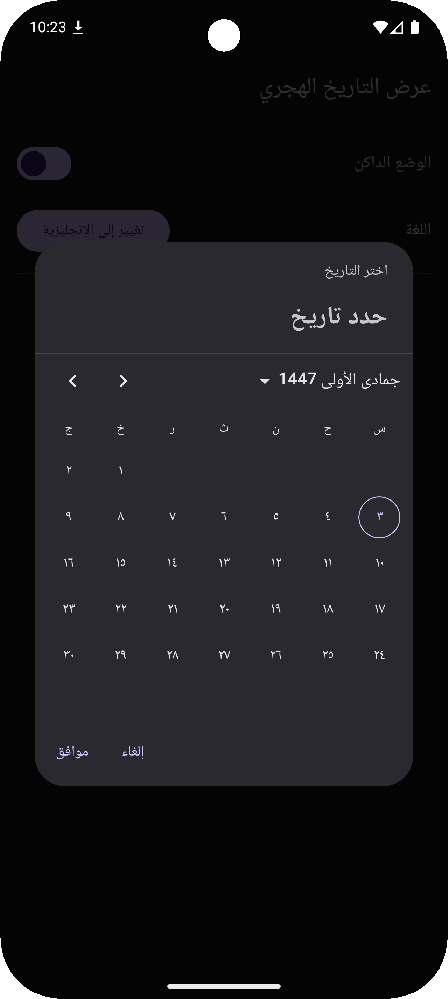

# Compose Hijri Date Picker

[](https://central.sonatype.com/artifact/io.github.helmy2/hijri-date-picker)
[](https://opensource.org/licenses/Apache-2.0)

A simple, lightweight, and customizable Hijri (Islamic) date picker for **Compose Multiplatform (Android, iOS, and Desktop)**.

## Screenshots

Here is the date picker shown on Android in both light and dark modes, for both English (LTR) and Arabic (RTL) locales.

| English (Light Mode)                                                                 | English (Dark Mode)                                                                |
|--------------------------------------------------------------------------------------|------------------------------------------------------------------------------------|
|  |  |
| **Arabic (Light Mode)**                                                              | **Arabic (Dark Mode)**                                                             |
|   |   |


## ✨ Features

- **Multiplatform:** Works seamlessly on Android, iOS, and Desktop (JVM).

- **Material 3 Design:** A clean, modern UI that fits perfectly with M3 themes.

- **Lightweight & Hoistable API:** Uses a `HijriDatePickerState` for easy state management.

- **Full Localization & Theming:**

  - Month/day names and numbers (`٠١٢٣`) are automatically localized.

  - Layout automatically switches to **RTL** for Arabic.

  - **Customizable Colors:** All colors can be themed via `HijriDatePickerDefaults.colors()`.

  - **Customizable Strings:** All text can be overridden for custom i18n via `HijriDatePickerDefaults.strings()`.

- **Flexible:** Allows you to set a custom range of years for the year picker.


## 🚀 Installation

This library is published to **Maven Central**.

Add the dependency to your `commonMain` source set in your `build.gradle.kts` file:

```kotlin
// In your build.gradle.kts (in commonMain)
dependencies {
    implementation("io.github.helmy2:hijri-date-picker:0.0.2")
}
```

## 💻 Usage

### Basic Usage

The `HijriDatePicker` is a content composable. It's designed to be placed inside a container like `DatePickerDialog` (from Material 3) or a `BottomSheet`.

Here is a complete example of how to use it inside a `DatePickerDialog`:

```kotlin
import androidx.compose.material3.Button
import androidx.compose.material3.DatePickerDialog
import androidx.compose.material3.Text
import androidx.compose.material3.TextButton
import androidx.compose.runtime.Composable
import androidx.compose.runtime.getValue
import androidx.compose.runtime.mutableStateOf
import androidx.compose.runtime.remember
import androidx.compose.runtime.setValue
import io.github.helmy2.HijriDatePicker
import io.github.helmy2.HijriDate
import io.github.helmy2.rememberHijriDatePickerState

@Composable
fun MyScreenWithPicker() {
    var showPicker by remember { mutableStateOf(false) }
    var selectedDate by remember { mutableStateOf<HijriDate?>(null) }
    
    // 1. Create and remember the state for the picker
    val datePickerState = rememberHijriDatePickerState()

    // 2. A button to show the dialog
    Button(onClick = { showPicker = true }) {
        Text("Show Hijri Date Picker")
    }

    // 3. Show the dialog when showPicker is true
    if (showPicker) {
        DatePickerDialog(
            onDismissRequest = { showPicker = false },
            confirmButton = {
                TextButton(
                    onClick = {
                        // 4. Get the date from the state and close the dialog
                        selectedDate = datePickerState.selectedDate
                        showPicker = false
                    }
                ) {
                    Text("OK")
                }
            },
            dismissButton = {
                TextButton(onClick = { showPicker = false }) {
                    Text("Cancel")
                }
            }
        ) {
            // 5. Place the HijriDatePicker as the dialog's content
            HijriDatePicker(state = datePickerState)
        }
    }
}
```

### Advanced Customization

You can customize the picker by passing parameters to `rememberHijriDatePickerState` and `HijriDatePicker`.

```kotlin
import io.github.helmy2.HijriDatePicker
import io.github.helmy2.HijriDatePickerDefaults
import io.github.helmy2.KmpHijriCalendar
import io.github.helmy2.rememberHijriDatePickerState
import androidx.compose.ui.graphics.Color

// ...

val state = rememberHijriDatePickerState(
    // Set an initial selected date
    initialDate = KmpHijriCalendar.of(1447, 9, 1), // 1 Ramadan 1447
    
    // Provide a custom range of years for the year picker
    yearRange = 1400..1450
)

// Get the default colors and strings
val customColors = HijriDatePickerDefaults.colors().copy(
    selectedDayContainerColor = Color(0xFF800000), // Dark red
    onSelectedDayContainerColor = Color.White
)

val customStrings = HijriDatePickerDefaults.strings().copy(
    selectDateTitle = "Select Hijri Date"
)

HijriDatePicker(
    state = state,
    colors = customColors,
    strings = customStrings
)
```

## 🗺️ Roadmap 
Our goal is to bring the full functionality of the Material 3 Date Picker to the Hijri calendar system.

### Current Support

- [x] ✅ **Single Date Selection**

- [x] ✅ **Calendar View** (Month & Year)

- [x] ✅ **Android**

- [x] ✅ **Desktop (JVM)**

- [x] ✅ **iOS**


### Future Enhancements

- [ ] ⏳ **Date Range Selection:** Implement a `HijriDateRangePicker` for selecting a start and end date.

- [ ] ⏳ **Date Input Mode:** Add a toggle to switch from the calendar grid to text fields for manual date entry.

- [ ] ⏳ **Web (JS) Support:** Complete the KMP targets by adding a web canvas implementation.

- [ ] ⏳ **Advanced Validation:** Add `SelectableDates` support to disable specific dates or ranges (e.g., weekends).

## 📄 License

This library is licensed under the **Apache 2.0 License**.